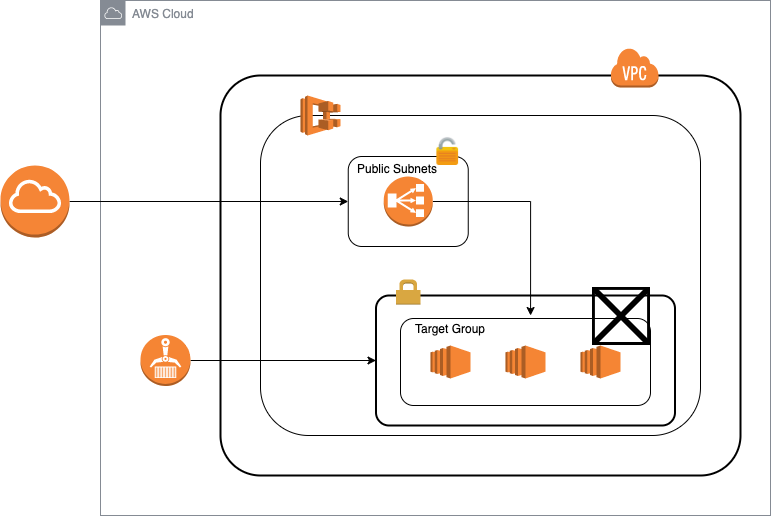

# ECS-Cloudformation-Stack-Example
This repository contains a brief example on how to deploy containers using Elastic Container Service and CloudFormation services from AWS. 



It is conformed by 5 files (stacks), each one with the infrastructure related to its name: 
1. main.yaml
1. VPC.yaml
1. LoadBalancer.yaml
1. Containers.yaml
1. ECS.yaml

## Infrastructure used
The following networking approach is used in this example:

- A public VPC subnet with direct internet access
- A private VPC subnet without direct internet, where the auto-scaling group resides. 

For the hosting of the containers, it is used a self managed (auto-scalable) cluster of EC2 hosts for control over instance type

When it comes to sending traffic to the container, there is a public facing load balancer that accepts traffic from anyone on the internet.


## How to use this repo 
To use this templates, first you need to create a bucket in your AWS account, and then update all files except main.yaml. Once the files are uploaded, you need to modify main.yaml, so your resources stacks can point to the correct URL of the file. 

For example, if the name of your bucket is example-bucket, change the main.yaml file to this (in all your resources). 

```
LoadBalancer: 
    Type: AWS::CloudFormation::Stack
    Properties: 
      Parameters: 
        VPC: !GetAtt VPC.Outputs.VPCID
        PublicSubnetOne: !GetAtt VPC.Outputs.PublicSubnet1ID
        PublicSubnetTwo: !GetAtt VPC.Outputs.PublicSubnet2ID 
      TemplateURL: https://example-bucket.s3.amazonaws.com/LoadBalancer.yaml
```

Then, to create the infrastructure in your account, open cloudformation service, and create a new stack using the main.yaml template. Each of the service stacks has default values prefilled for launching a simple nginx container, but can be adjusted to launch your own container.